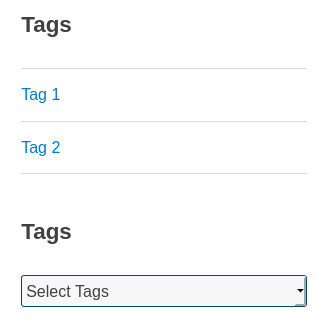

# Minimalist-Tags-List

This WordPress plugin create a widget to display list or dropdown of tags.

## Description

This WordPress plugin is a widget displaying tags list like the native Categories widget of WordPress. By default, WordPress only offers a tags cloud. With this widget, you can display a list or use a dropdown menu and display the number of posts or not.

## Installation

### Composer installation

You can use composer to install this plugin as a dependency:

```
{
"require": {
    "armandphilippot/minimalist-tags-list": "dev-master"
}
"repositories": [{
    "type": "git",
    "url": "git@github.com:ArmandPhilippot/minimalist-tags-list.git"
}]
```

### Manuel installation

You can download this plugin on Github, then extract it in `/wp-content/plugins/` directory.

## Utilisation

1. Navigate to the "Plugins" dashboard page and click on "Activate".
2. Add "Tags List" to a widget area through the 'Widgets' menu in WordPress.
3. Configure settings.

## Screenshot



This plugin contains no style. This screenshot shows you the two possibilities suited to a theme.

## Changelog

| Version | Date       | Notes                                                               |
| ------- | ---------- | ------------------------------------------------------------------- |
| v1.0.1  | 2020-05-24 | Removal of the hierarchy option since tags have no hierarchy. |
| v1.0.0  | 2020-03-05 | Initial version                                                      |

## License

The Minimalist-Tags-List plugin is licensed under the GPL v2 or later. A copy of the license is included in the root of the plugin’s directory. The file is named LICENSE.
